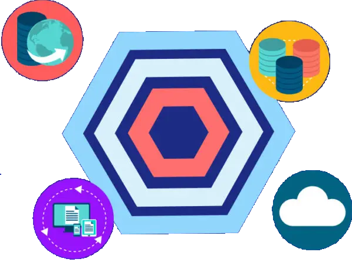
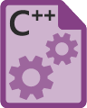

# Sobre o Projeto

Este projeto foi desenvolvido com o objetivo de estudar e aplicar, de forma prática, os conceitos de Arquitetura Limpa/Arquitetura Hexagonal. Além disso, busca demonstrar diretamente no código a implementação e o uso de diversas práticas e ferramentas. A organização dos diretórios não é apresentada como uma abordagem definitiva, mas como uma sugestão que visa facilitar a compreensão e a implementação. A seguir, são detalhadas as práticas e ferramentas utilizadas no projeto.

### ⚙️ Práticas Utilizadas

-  **Arquitetura Hexagonal**  
  
  - Implementação dos princípios fundamentais da Arquitetura Hexagonal (Ports e Adapters).
    
### 📚 Bibliotecas Utilizadas

-  **PHPStan** 
  
  - Biblioteca de Análise Estática de Código  

### 🧪 Testes

-  
  
  - Framework de Testes PHP.

### 🛠️ Ferramentas Utilizadas 

-  **Makefile**  
  - Comandos para facilitar a execução de tarefas no projeto.